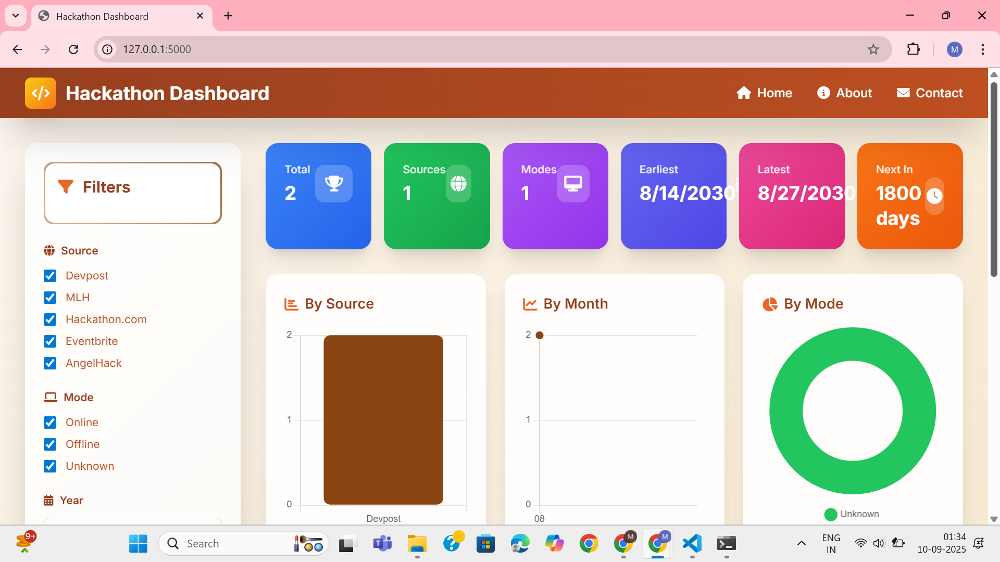
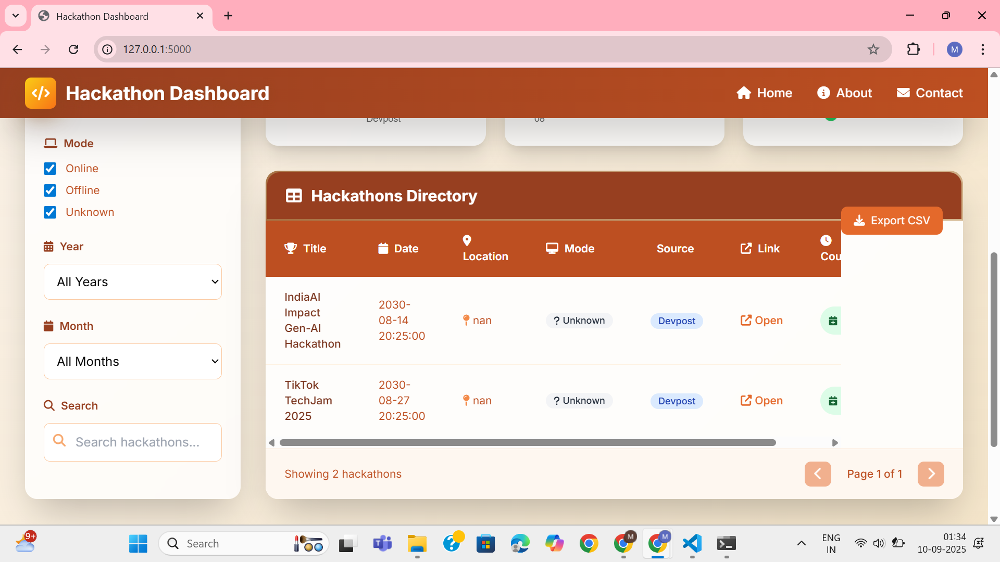
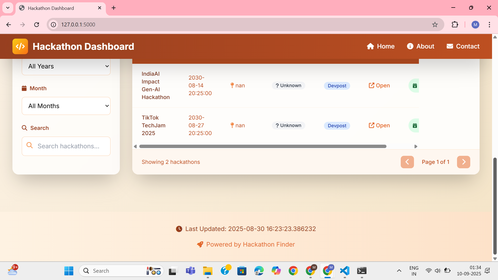

# 🚀 Hackathon Finder

A **Hackathon Discovery Dashboard** that scrapes and aggregates hackathon events from multiple platforms (Devpost, MLH, Hackathon.com, Eventbrite, AngelHack) and displays them in a clean, professional dashboard.  
This project helps developers, students, and innovators easily **discover upcoming hackathons**, filter them by source, mode, year, or month, and explore details interactively.

---

## 📌 Problem Statement
Finding hackathons across multiple platforms is difficult because events are scattered, formats differ, and information is often outdated.  
Participants waste time searching manually and often miss opportunities.  

---

## 🎯 Abstract
Hackathon Finder solves this by:
- **Scraping hackathon data** from popular websites  
- **Cleaning and enriching** the dataset  
- **Displaying events** on a professional dashboard (Flask + HTML + Tailwind + JavaScript)  
- **Filters and charts** for quick exploration  
- **Clickable links** to register instantly  

---

## ✨ Features
- 🔎 Aggregate hackathons from **5 major sources**
- 📅 Filter by **year, month, source, mode**
- 📊 Charts for hackathons by **month, source, and mode**
- 🖱️ Interactive **searchable & sortable table**
- 🔗 Clickable links to hackathon pages
- ⏳ Countdown to upcoming hackathons
- 🎨 Professional UI with **Brown + Beige theme**
- 📱 Fully responsive (mobile + desktop)

---

## 🖼️ Screenshots
> Add your screenshots inside `/screenshots` folder  

  
 
 

---

## 🛠️ Tech Stack
**Frontend:**  
- HTML5, CSS3, TailwindCSS  
- JavaScript (Vanilla + DataTables.js + Chart.js)  

**Backend:**  
- Python  
- Flask   

**Data:**  
- Web scraping (Selenium, BeautifulSoup)  
- CSV storage  


---

## 🧩 Approach
1. **Scraping** hackathon data from Devpost, MLH, Hackathon.com, Eventbrite, AngelHack  
2. **Cleaning & enriching** dataset (dates, mode, deduplication)  
3. **Storing results** in `hackathons_final.csv`  
4. **Flask backend** serves data to frontend  
5. **HTML + Tailwind + JS dashboard** renders filters, charts, and tables  
6. **Deployed on Render** for public access  

---

## ⚙️ Setup Instructions

### 1️⃣ Clone the Repository
```bash
git clone https://github.com/ManvithaPola/Hackathon-Finder.git
cd Hackathon-Finder
```
### 2️⃣ Create Virtual Environment (Windows)
```bash
python -m venv venv
venv\Scripts\activate
```
### 3️⃣ Install Dependencies
```bash
pip install -r requirements.txt
```
### 4️⃣ Run Locally
```bash
python app.py
```
Visit: http://127.0.0.1:5000

---

### 🔮 Future Enhancements

- ✅ User login & registration (personalized hackathon tracker)
- ✅ Search & filter hackathons by country, domain, or prize pool
- ✅ Email reminders for deadlines
- ✅ Integration with APIs (Devpost, MLH, HackerEarth, etc.)
- ✅ Dark mode UI for a futuristic experience
- ✅ Leaderboard & community discussions